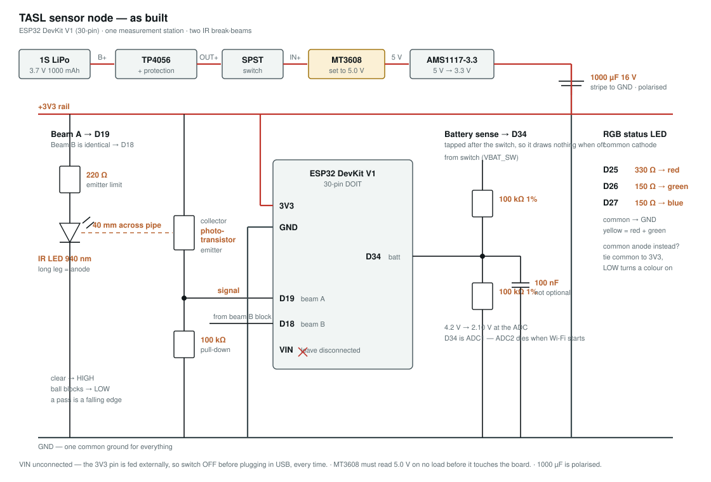

# TASL — modular marble-run engineering challenge

A collaborative marble-run built by ~10 teams of senior engineers. A 25 mm
steel ball travels from a common START to a common FINISH through every team's
module. Battery-powered ESP32 nodes watch the ball with IR break-beams, time
it, and report to a laptop running a live dashboard over an offline Wi-Fi
network.



---

## Status

| Step | What | State |
|---|---|---|
| 1 | Live dashboard fed by 3 simulated nodes | **done** |
| 2 | Real ESP32s connected over Wi-Fi | **done — 3 nodes reporting** |
| 3 | IR beam circuit built and range-tested | **done — 40 mm gap working** |
| 4 | Battery sensing + RGB status LED | in progress |
| 5 | Two beams per node, real ball velocity | not started |
| 6 | Replicate across 20 nodes | not started |

---

## Quick start

Two terminals, from the repo root.

```bash
python -m pip install -r requirements.txt
```

**Terminal 1 — dashboard server:**

```bash
python run_server.py
```

**Terminal 2 — three simulated nodes (no hardware needed):**

```bash
python sim/run_mocks.py
```

Open <http://localhost:8000>.

With real hardware, skip terminal 2 and power the nodes instead.

### Before plugging in hardware

```bash
powershell -ExecutionPolicy Bypass -File tools\preflight.ps1
```

macOS (the event-day machine):

```bash
bash tools/preflight.sh
```

Checks the laptop's IP, firewall, network profile, Wi-Fi band and Python deps.
It changes nothing — it prints the commands you need.

---

## Repo map

```
server/          FastAPI dashboard server
  protocol.py      THE CONTRACT — exact JSON a node sends. Firmware must match.
  store.py         Node state, run state, SQLite logging
  diagnostics.py   Fault rules: what's wrong and what to check
  app.py           HTTP + WebSocket endpoints
  static/          Dashboard UI (plain HTML/CSS/JS, no build step)

sim/             Simulated ESP32 nodes — speak the identical protocol
config/          nodes.json — node registry, order, gap_mm per station

firmware/
  tasl_node_conn_test/   Main node firmware (Wi-Fi + reporting)
  tasl_beam_align/       Standalone bench tool for aiming the beams
  CONNECTING_NODES.md    Flashing and network setup walkthrough

hardware/
  DECISIONS.md           Why the node is built this way — read this first
  BEAM_CIRCUIT.md        As-built beam circuit, measured values
  NODE_WIRING.md         Original design study and rationale
  schematic-node.svg     Full node schematic
  *.SLDPRT *.STL *.gcode Enclosure CAD and print files

openmarket/      TASL coin CAD/DXF for the activity's internal economy
tools/           preflight.ps1 (Windows) · preflight.sh (macOS)
EVENT_DAY_MACOS.md   Event-day setup for the MacBook
```

**Where docs disagree,** [`hardware/DECISIONS.md`](hardware/DECISIONS.md) and
[`hardware/BEAM_CIRCUIT.md`](hardware/BEAM_CIRCUIT.md) win — they record what
was built and measured. `NODE_WIRING.md` is the earlier design study.

---

## Bill of materials

### Per node

| # | Part | Value / spec | Qty | Notes |
|---|---|---|---|---|
| 1 | ESP32 DevKit V1 | 30-pin DOIT | 1 | **Not** the 36-pin DevKitC — pin positions differ |
| 2 | TP4056 module | **with protection** | 1 | Must carry `DW01A` + `8205A`. Without them there's no over-discharge cutoff |
| 3 | MT3608 boost module | adjustable | 1 | **Set to 5.0 V before connecting.** Ships arbitrary, ranges to 28 V |
| 4 | AMS1117-3.3 regulator | 5 V → 3.3 V | 1 | Fed from the boost, never from the cell |
| 5 | 1S LiPo | 3.7 V **1000 mAh** | 1 | 500 mAh works for prototyping only — see DECISIONS D5 |
| 6 | SPST switch | ≥500 mA | 1 | Breaks the plus side only |
| 7 | IR LED, 940 nm | 5 mm, clear | 2 | One per beam. Long leg = anode |
| 8 | IR phototransistor | 5 mm, dark tint | 2 | One per beam. Test which leg is the collector |
| 9 | RGB LED | 5 mm, 4-pin, common cathode, diffused | 1 | Diffused — clear ones are hard to read off-axis |
| 10 | Resistor **220 Ω** | ¼ W | 2 | IR emitter current limit |
| 11 | Resistor **100 kΩ** | ¼ W | 2 | Phototransistor pull-downs. This value is what gives 40 mm range |
| 12 | Resistor 100 kΩ **1%** | ¼ W | 2 | Battery divider — 1% matters, see below |
| 13 | Resistor 330 Ω | ¼ W | 1 | RGB red |
| 14 | Resistor 150 Ω | ¼ W | 2 | RGB green, blue |
| 15 | Capacitor **1000 µF** | electrolytic, 16 V | 1 | Bulk across the 3V3 rail. **Polarised** — stripe to GND |
| 16 | Capacitor 100 nF | ceramic | 2 | One on the ADC divider, one at the ESP32 supply pins |
| 17 | JST-XH 2-pin | male + female | 1 | Battery to board |
| 18 | JST-XH 3-pin | male + female | 2 | One per beam cartridge |
| 19 | Perfboard | | 1 | |

Two values worth not substituting:

- **100 kΩ pull-down (#11).** Measured, not theoretical. It took usable beam
  range from ~5 mm to comfortably past 40 mm. A 10 kΩ only works with the
  parts nearly touching.
- **1% resistors for the divider (#12).** The ratio sets your battery reading
  directly, and 5% parts give ±5% error on a measurement whose entire job is
  distinguishing 3.65 V from 3.80 V.

### Per station (mechanical)

| Part | Spec | Notes |
|---|---|---|
| Steel bearing ball | 25 mm | Bearing-grade |
| PVC pipe | 1½" Schedule 40 | ~40 mm bore; the wall doubles as the light shroud |
| 3D-printed enclosure | PETG | `hardware/*.STL`, gcode included |

### Shared infrastructure

| Part | Notes |
|---|---|
| Wi-Fi router | TP-Link Archer AX53 class. **2.4 GHz SSID must be separate** from 5 GHz — ESP32 cannot see 5 GHz at all |
| Laptop | Runs the dashboard. Fixed IP via DHCP reservation |

---

## How it works

Two HTTP endpoints, both `POST` with a small JSON body:

- `POST /api/heartbeat` — every 2 s, always
- `POST /api/event` — when something happens (`BOOT`, `BALL_PASS`, beam faults)

### The one design rule that matters

**The node computes Δt and speed itself, from its own microsecond clock,
before it touches Wi-Fi.** The laptop never times anything.

```
beam A → micros()  ─┐
beam B → micros()   ├─ all on-node, before the radio is touched
compute Δt, speed  ─┘
                    → then transmit one finished result
```

Wi-Fi latency, packet retries, reconnects and laptop clock drift can only
affect *when a result is displayed*, never the result itself. No NTP, no clock
sync between nodes — each node only ever compares two of its own timestamps.

The simulator in `sim/` speaks this identical protocol, which is why the
dashboard needed no changes when real hardware arrived.

---

## Troubleshooting

The wrench icon (top right of the dashboard) opens a panel that says what's
wrong per node and what to check, ordered by what's quickest and most likely.
A small red dot appears when there's something to look at — no counts, no
blinking, because the audience is watching the same screen.

It distinguishes the cases that matter: a node that *died* versus one that was
*never configured correctly* versus one that's *online but seeing nothing*.

---

## Secrets

Wi-Fi credentials and the laptop IP live in `firmware/*/secrets.h`, which is
gitignored. To build the firmware:

```bash
cd firmware/tasl_node_conn_test
cp secrets.example.h secrets.h
```

Then fill in your own values. Never commit `secrets.h`.

---

## Notes on schematics

There is **no KiCad MCP available** in this setup — the connector registry has
no EDA integration, and none is installed. The schematic here is a hand-built
SVG ([`hardware/schematic-node.svg`](hardware/schematic-node.svg)), which is
what the build actually needs: the boards are hand-soldered on perfboard, and
the scarce information is *what connects to what*, not component placement.

If this ever moves to a fabricated PCB, KiCad becomes worth the setup. Until
then the net tables in `BEAM_CIRCUIT.md` and `NODE_WIRING.md` are the
authority.
